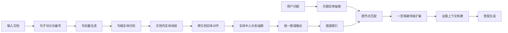
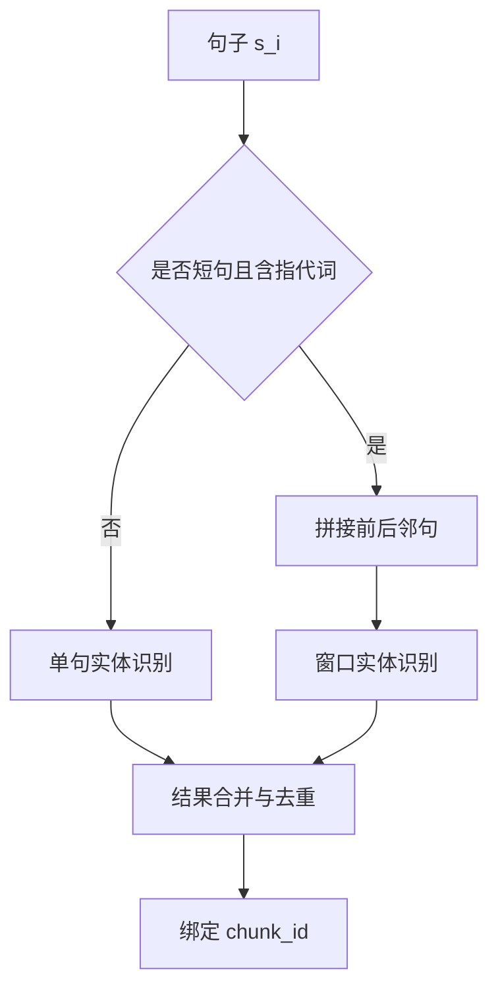
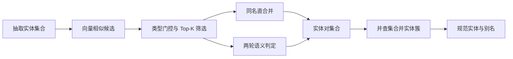
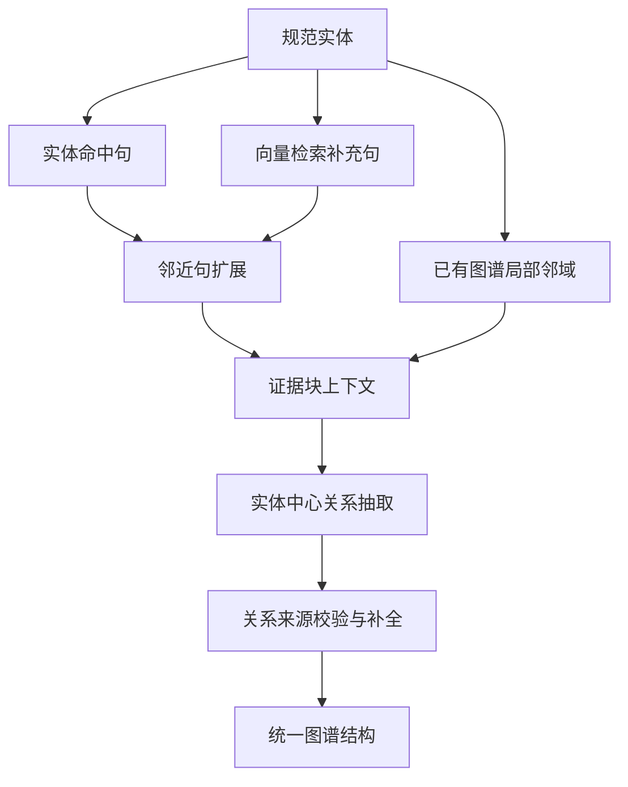
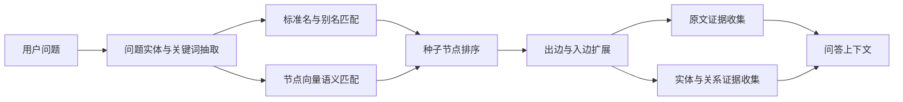
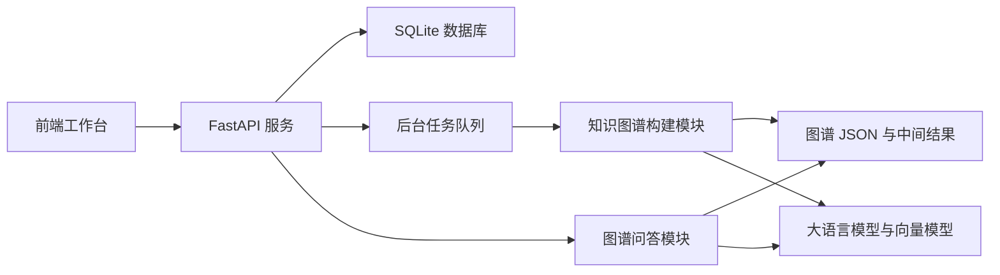
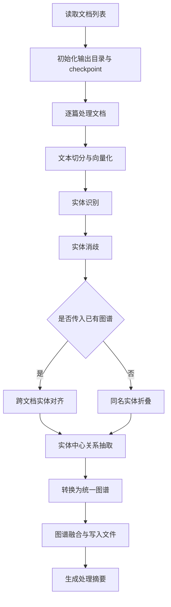

# 摘要
# Abstract
# 目录
# 第1章 绪论
## 1.1 研究工作的背景与意义

随着大语言模型在自然语言理解、文本生成和知识问答等任务中的快速发展，基于大模型的人机交互方式正在从传统的信息检索逐步转向面向自然语言问题的智能问答。相比传统搜索引擎返回文档列表的方式，大语言模型能够直接理解用户问题，并以连贯的自然语言形式生成答案，在政务咨询、企业知识库、教育辅助、医疗问答和科研信息分析等场景中表现出较强的应用潜力。然而，大语言模型的回答主要依赖训练阶段形成的参数化知识，其内部知识难以及时更新，且生成过程并不总是严格受事实约束。当用户问题涉及专业领域知识、私有文档内容或最新业务资料时，模型容易出现事实错误、依据不清、回答过度推断等问题，即通常所说的“幻觉”现象。这类问题限制了大语言模型在严肃知识问答场景中的直接落地。

检索增强生成（Retrieval-Augmented Generation，RAG）为缓解上述问题提供了一种有效思路。RAG 通过在生成答案前引入外部知识检索，将用户问题与文档库中的相关片段进行匹配，再把检索到的文本作为上下文交给大语言模型生成答案。该方法能够在一定程度上提升回答的事实性和知识时效性，并使系统具备接入私有知识库的能力。Lewis 等人提出的 RAG 框架证明了检索机制与生成模型结合在知识密集型任务中的有效性。
[[2005.11401] Retrieval-Augmented Generation for Knowledge-Intensive NLP Tasks](https://arxiv.org/abs/2005.11401)

但是，传统 RAG 仍然存在明显局限。其检索过程通常以文本块为基本单位，主要依赖向量相似度召回相关片段。这种方式适合处理局部事实查询，但在面对多实体、多关系、跨文档整合和多跳推理问题时，容易出现召回片段分散、上下文组织松散、实体关系不显式等问题。例如，在企业问答场景中，用户经常询问某个项目、部门、人员、产品、合同或制度之间的关联关系，答案往往并不只存在于单个文本片段中，而是分布在多个文档、多个段落甚至多个业务对象之间。如果系统只能按语义相似度检索若干文本块，就很难稳定地组织实体之间的结构化关系，也难以给出清晰的推理路径和证据来源。

知识图谱是一种以实体为节点、以关系为边的知识组织方式，能够将非结构化文本中的对象、属性和语义联系显式表示出来。与普通文本片段相比，知识图谱在关系表达、路径查询、实体聚合和可解释性方面具有优势。Hogan 等人指出，知识图谱不仅是一组三元组的集合，还涉及实体身份识别、模式约束、上下文表示、知识融合与质量控制等问题。
[[2003.02320] Knowledge Graphs](https://arxiv.org/abs/2003.02320)
因此，将知识图谱引入 RAG 流程，可以在文本检索之外增加结构化知识检索能力，使系统不仅能够召回相关原文，还能够沿着实体和关系组织证据，从而增强问答过程的可解释性。

不过，知识图谱单独用于开放领域或企业文档问答时也存在不足。一方面，图谱构建需要完成实体识别、关系抽取、实体消歧、知识融合等多个环节，构建成本较高；另一方面，人工构建或规则构建的知识图谱难以覆盖不断变化的文档内容，图谱不完整时又会影响问答系统的召回能力。随着大语言模型和向量表示技术的发展，利用大模型辅助实体抽取、关系抽取和答案生成，同时利用向量检索补充语义召回，成为一种较为可行的工程方案。基于此，本文围绕知识图谱与 RAG 的融合方法展开研究，设计并实现一个面向文档知识问答的原型系统，目标是在保证工程可落地性的前提下，提高知识问答的准确性、可解释性和证据可追溯性。

本课题尤其关注企业文档问答场景下的数据特点。与普通开放网页文本相比，企业内部文档通常具有更强的领域性和业务上下文依赖性，文档中包含大量项目名称、组织机构、人员角色、产品模块、制度条款和业务流程等实体，信息密度和实体密度较高。同时，同一实体在不同文档中可能存在简称、别名、旧名称、新名称以及不同粒度的描述，例如同一部门可能被称为“研发部”“技术研发中心”或具体项目组名称，同一业务系统也可能在需求文档、接口文档和测试报告中以不同表述出现。如果缺少实体对齐与消歧机制，系统构建出的知识图谱容易出现重复节点、关系断裂和证据分散等问题，进而影响问答效果。因此，在 RAG 中引入知识图谱并重点处理实体规范化、跨文档对齐和证据绑定问题，具有明确的研究意义和应用价值。

## 1.2 国内外研究现状

围绕大语言模型知识问答，国内外研究主要集中在检索增强生成、知识图谱构建、图结构增强问答以及大模型辅助信息抽取等方向。

在检索增强生成方面，早期代表性研究将神经检索器与生成模型结合，使生成模型在回答知识密集型问题时能够利用外部文档。后续研究进一步将 RAG 扩展为覆盖检索前处理、检索器优化、重排序、上下文压缩、生成约束和答案评估的系统性框架。相关综述将 RAG 分为朴素 RAG、增强型 RAG 和模块化 RAG 等类型，说明 RAG 已经从简单的“检索片段并拼接上下文”发展为一套可组合、可优化的知识增强生成体系。
[[2312.10997] Retrieval-Augmented Generation for Large Language Models: A Survey](https://arxiv.org/abs/2312.10997)
在实际应用中，RAG 的优势在于能够接入外部知识库和私有文档库，使系统回答具有更好的时效性和领域适应性。但其主要检索对象仍然是文本块，对实体关系和跨文档结构的利用不足。

在知识图谱构建方面，传统方法通常将任务拆分为命名实体识别、关系抽取、实体链接、实体对齐、知识融合和质量评估等环节。近年来，大语言模型在信息抽取任务中的应用逐渐增多，研究者开始利用模型的语义理解能力从非结构化文本中抽取实体、属性和关系。关系抽取相关综述指出，关系抽取是知识图谱构建和知识库补全中的关键任务，其效果直接影响图谱的完整性和下游应用能力。
[[2306.02051] A Comprehensive Survey on Relation Extraction: Recent Advances and New Frontiers](https://arxiv.org/abs/2306.02051)
不过，仅依赖大语言模型直接生成图谱也存在不稳定问题，例如输出格式不一致、关系缺少证据支撑、实体重复或同名异义等。因此，在工程实现中通常需要结合结构化约束、检索上下文、实体消歧和图谱合并机制，提高图谱构建结果的可靠性。

在知识图谱与 RAG 融合方面，GraphRAG 等研究提出先从文档集合中抽取实体和关系，构建图结构，再利用图结构进行社区摘要、全局检索和查询聚焦生成，从而提升系统处理全局性问题和跨文档问题的能力。
[[2404.16130] From Local to Global: A Graph RAG Approach to Query-Focused Summarization](https://arxiv.org/abs/2404.16130)
这类工作表明，图结构能够弥补纯向量检索在多跳关系和全局信息组织方面的不足。相比单纯返回相似文本片段，图谱增强检索可以围绕问题实体扩展相邻节点和关系路径，从而为答案生成提供更有组织的证据。然而，现有方法在不同应用场景下仍面临若干挑战，例如图谱构建成本较高、实体标准化难度较大、关系证据绑定不足、增量更新流程复杂等。

在实体消歧与实体对齐方面，国内外已有大量研究关注如何判断不同知识库或不同文档中的实体是否指向同一现实对象。相关综述指出，实体对齐通常需要综合利用实体名称、属性、关系结构和表示学习结果。
[[2103.15059] A Benchmark and Comprehensive Survey on Knowledge Graph Entity Alignment via Representation Learning](https://arxiv.org/abs/2103.15059)
对于企业文档问答场景而言，实体对齐问题尤为突出。由于企业内部名称体系并不总是规范统一，同一实体可能在不同部门、不同时间或不同文档中具有不同叫法。若图谱构建阶段无法识别这些别名和相似实体，后续问答阶段即使检索到了局部证据，也难以将相关信息聚合到同一个知识节点上。

综上，现有研究已经证明了 RAG 在知识增强生成中的有效性，也证明了知识图谱在结构化知识组织和可解释问答中的价值。但在面向企业文档的实际系统中，仍需要进一步解决三类问题：第一，如何从高密度文档中稳定抽取实体和关系；第二，如何对跨文档出现的相似实体进行消歧和标准化；第三，如何在问答阶段同时利用图谱结构和原文证据，避免生成答案脱离证据。本文的研究正是在上述背景下展开。

## 1.3 本文的研究内容

本文围绕“知识图谱增强的检索生成问答系统”展开研究，结合大语言模型、向量检索和知识图谱技术，设计并实现相应的原型系统。本文的主要研究内容包括以下几个方面。

第一，研究面向文档的知识图谱构建流程。系统首先对输入文档进行句子切分，生成稳定的文本块标识，并计算句向量表示；随后以句子为基本单位进行实体抽取，同时针对短句和指代句引入上下文窗口补充机制，降低单句信息不足对实体识别效果的影响。对于抽取得到的实体，系统进一步结合向量相似度和大语言模型语义判定进行实体消歧，减少同一文档内部的重复实体。

第二，研究跨文档实体对齐与图谱增量融合方法。在多文档场景中，新文档抽取出的实体需要与已有图谱中的标准实体进行对齐。本文设计了基于候选召回和语义判定的实体对齐流程，将新实体映射到已有图谱标准名，并保留别名信息。对于新增文档生成的局部图谱，系统进一步通过实体归并、关系去重和来源证据合并，实现 `entities + relations + chunk_map` 形式的统一图谱融合。

第三，研究基于证据约束的关系抽取方法。系统不直接要求大语言模型在整篇文档上自由生成关系，而是围绕中心实体构造关系抽取上下文。该上下文由实体命中句、向量检索补充句、邻近句以及已有图谱局部邻域共同组成。关系抽取结果需要绑定具体文本块来源，缺少证据支撑的关系不作为可靠关系输出，从而提高图谱关系的可追溯性。

第四，研究图谱增强的问答检索与答案生成方法。在问答阶段，系统首先对问题进行实体和关键词抽取，将问题中的实体映射到图谱节点；然后围绕匹配节点进行一跳到两跳邻域扩展，收集相关实体、关系、图路径和原文证据；最后将结构化证据转写为大语言模型可使用的上下文，并要求模型基于给定证据生成答案、证据来源和图路径。该方法使问答结果不仅包含自然语言答案，也能展示回答依据。

第五，完成前后端原型系统实现与实验评测。系统后端采用 FastAPI 和 SQLite 实现任务队列、知识图谱构建、图谱问答、日志查询等接口；前端采用 React 和 Vite 实现图谱构建、问答检索和系统状态展示等功能。在实验部分，本文将从知识图谱构建效果和问答效果两个角度进行评估，并与朴素 RAG 进行对比分析。

## 1.4 本文的结构安排

本文共分为七章，各章内容安排如下。

第 1 章为绪论，介绍本文的研究背景与意义，分析国内外在 RAG、知识图谱构建和图谱增强问答方向的研究现状，明确本文的研究内容和论文整体结构。

第 2 章为相关技术及理论基础，主要介绍知识图谱、检索增强生成、大语言模型与提示工程、实体识别与关系抽取、向量检索与语义相似度计算等理论和技术基础，为后续系统设计与方法实现提供支撑。

第 3 章为系统需求分析与总体架构设计，分析系统建设目标、功能需求和非功能需求，并从数据层、算法层、服务层和前端展示层等角度给出系统总体架构，说明知识图谱构建链路和图谱增强问答链路的整体流程。

第 4 章为核心方法设计，详细阐述本文提出的知识图谱增强检索生成方法，包括文本预处理与分块、句级实体识别、文档内实体消歧、跨文档实体对齐、图谱增量融合、证据约束关系抽取、图谱索引检索以及基于图路径和证据上下文的答案生成方法。

第 5 章为系统实现，介绍系统开发环境、后端服务、任务队列、知识图谱构建模块、图谱问答模块、前端工作台以及关键接口和数据结构设计，说明本文方法在工程系统中的落地方式。

第 6 章为实验设计与结果分析，介绍实验目标、数据集、评价指标和对比方法，分别从知识图谱构建效果、问答性能、系统功能展示和案例分析等角度验证系统效果，并对存在的问题进行分析。

第 7 章为总结与展望，总结本文完成的主要工作和取得的结果，分析当前系统的不足，并从多文档全局图谱累积、实体标准化、关系抽取质量、大规模数据集验证和系统部署等方面展望后续改进方向。

# 第2章　相关技术及理论基础
## 2.1 知识图谱相关理论
知识图谱是一种以图结构组织知识的表示方式，通常以实体为节点、以关系为边，并辅以属性、模式、上下文等信息来表达现实世界中的语义关联。与普通文本片段相比，知识图谱能够将对象及其联系显式化，使知识不仅可以被阅读，也可以被查询、合并和推理。Hogan 等人指出，知识图谱不仅关注数据的图结构表达，还涉及模式约束、身份识别、上下文表示、知识抽取、知识融合、质量评估与发布应用等多个层面。由此可见，知识图谱并不是简单的“三元组集合”，而是一套兼具表示能力、可查询性与可扩展性的知识组织体系。
[[2003.02320] Knowledge Graphs](https://arxiv.org/abs/2003.02320)

从基本构成看，知识图谱通常包含实体、关系和属性三类核心元素。实体表示现实世界或特定领域中的对象，例如人员、组织、项目、产品、制度条款等；关系表示实体之间的语义联系，例如“隶属于”“负责”“包含”“依赖于”等；属性则用于描述实体自身的特征信息。若以三元组形式表示，知识可写作“头实体—关系—尾实体”。在更完整的图谱系统中，实体还可能具有类型、别名、描述、来源证据和上下文信息，这些信息共同决定了图谱在检索问答、关系分析和证据追溯中的可用性。

面向非结构化文本构建知识图谱时，通常需要完成命名实体识别、关系抽取、实体规范化、知识融合与质量控制等关键环节。其中，命名实体识别负责从文本中发现具有独立语义的对象，关系抽取负责识别实体之间的关联，实体规范化和知识融合则用于处理同名异义、异名同义、重复节点和跨文档对齐等问题。关系抽取相关综述指出，关系抽取是知识图谱构建和知识库补全中的重要基础任务，其效果直接影响图谱结构的完整性与后续应用能力。
[[2306.02051] A Comprehensive Survey on Relation Extraction: Recent Advances and New Frontiers](https://arxiv.org/abs/2306.02051)

在多文档知识组织场景中，实体一致性是影响图谱质量的重要因素。同一实体可能在不同文档中以简称、别名、旧名称或不同粒度的描述出现，若缺少统一的实体识别与对齐机制，知识图谱容易出现冗余节点、关系断裂以及语义冲突等问题。实体对齐是知识库融合的重要组成部分，通常需要综合利用实体名称、属性、关系结构和向量表示等信息判断不同实体是否指向同一对象。相关研究表明，结构信息与表示学习方法在实体对齐任务中具有重要作用。
[[2103.15059] A Benchmark and Comprehensive Survey on Knowledge Graph Entity Alignment via Representation Learning](https://arxiv.org/abs/2103.15059)

知识图谱在问答系统中的价值主要体现在结构化组织和可解释检索两个方面。一方面，图谱能够围绕实体聚合分散在不同文本片段中的信息，使系统能够沿着关系边查找相关节点；另一方面，图谱中的路径和来源证据可以作为回答过程的解释线索，帮助用户理解答案所依据的实体、关系和原文内容。因此，在面向企业文档或专业领域文档的问答系统中，将知识图谱与文本检索结合，可以在一定程度上弥补单纯文本块检索对实体关系表达不足的问题。

## 2.2 检索增强生成技术
检索增强生成（Retrieval-Augmented Generation，RAG）是近年来面向知识密集型任务的重要研究方向，其核心思想是将大语言模型的参数化知识与外部可检索知识源结合起来，通过“先检索、后生成”的方式提升模型回答的事实性、时效性与可追溯性。Lewis 等人在 RAG 的代表性工作中提出，将预训练生成模型与检索机制相结合，使模型在生成答案时能够访问外部文档索引，从而缓解仅依赖参数记忆所带来的知识陈旧、事实错误与依据不清等问题。
[[2005.11401] Retrieval-Augmented Generation for Knowledge-Intensive NLP Tasks](https://arxiv.org/abs/2005.11401)

RAG 的基本流程通常包括查询理解、文档切分、向量表示、相似度检索、上下文构建以及答案生成等环节。系统首先将外部文档切分为较小的文本片段，并为这些片段建立检索索引；当用户提出问题后，系统将问题转换为检索查询，从文档库中召回与问题相关的片段；随后将召回结果作为上下文输入大语言模型，由模型在给定证据范围内生成答案。与直接使用大语言模型回答相比，RAG 的优势在于可以接入私有文档库和动态更新的知识源，使回答过程能够更多依赖可检索的外部证据。
[[2004.04906] Dense Passage Retrieval for Open-Domain Question Answering](https://arxiv.org/abs/2004.04906)

随着相关研究和工程实践的发展，RAG 已经从朴素的“检索—拼接—生成”流程逐步扩展为可组合、可优化的系统框架。相关综述通常将 RAG 划分为朴素型 RAG、增强型 RAG 和模块化 RAG。朴素型 RAG 强调基础检索链路，增强型 RAG 进一步关注查询改写、重排序、上下文压缩和生成约束，模块化 RAG 则将检索、路由、阅读、验证和反馈等环节拆分为可独立优化的模块。由此可见，RAG 并非单一检索模块的简单叠加，而是一套覆盖检索策略、上下文组织与生成控制的系统性方法。
[[2312.10997] Retrieval-Augmented Generation for Large Language Models: A Survey](https://arxiv.org/abs/2312.10997)

传统 RAG 在处理局部事实查询时具有较好的适用性，但在面对跨文档整合、多实体关联以及全局性问题时，容易受限于片段级召回方式。向量相似度检索通常能够找到语义相近的文本块，却难以显式表达实体之间的关系路径，也难以保证召回片段之间具有清晰的逻辑组织。为解决这类问题，图结构增强的检索生成方法开始受到关注。GraphRAG 等研究提出先从文档集合中抽取实体和关系，构建图结构，再结合图结构摘要、社区组织和查询聚焦生成处理全局性问题。相关工作表明，图结构能够补充普通向量检索在多跳关系和跨文档知识组织方面的不足。
[[2404.16130] From Local to Global: A Graph RAG Approach to Query-Focused Summarization](https://arxiv.org/abs/2404.16130)

在本文研究的问题场景中，RAG 提供了接入外部文档和约束答案生成的基本框架，知识图谱则提供了实体关系组织和路径解释能力。二者结合后，系统可以先通过检索和图节点匹配定位与问题相关的知识范围，再围绕实体邻域、关系路径和原文证据构建上下文，从而使答案生成不仅依赖相似文本片段，也能够利用结构化知识线索。

## 2.3 大语言模型与提示工程
大语言模型（Large Language Model，LLM）是基于大规模语料和深度神经网络训练得到的语言模型，能够在文本理解、信息抽取、摘要生成、问答和推理等任务中表现出较强的通用能力。与传统自然语言处理模型相比，大语言模型通常不需要为每一种任务单独训练完整模型，而是可以通过自然语言指令、示例和上下文信息引导模型完成特定任务。因此，大语言模型逐渐成为知识问答系统中的重要组件。
[[1706.03762] Attention Is All You Need](https://arxiv.org/abs/1706.03762)
[[2005.14165] Language Models are Few-Shot Learners](https://arxiv.org/abs/2005.14165)
[[2303.18223] A Survey of Large Language Models](https://arxiv.org/abs/2303.18223)

在知识图谱与检索增强问答系统中，大语言模型主要承担三类作用。第一，大语言模型可以辅助完成实体识别和关系抽取，将非结构化文本中的对象及其关联转化为结构化记录。第二，大语言模型可以参与实体消歧和语义判定，例如判断两个名称相近或描述相似的实体是否指向同一对象。第三，在问答阶段，大语言模型可以根据检索到的文本证据、图谱关系和路径信息生成自然语言答案。上述能力使大语言模型能够连接非结构化文本、结构化图谱与用户自然语言问题。

提示工程是指通过设计输入提示来约束和引导大语言模型输出的技术方法。一个有效的提示通常需要明确任务目标、输入范围、输出格式、约束条件和错误处理要求。例如，在实体抽取任务中，提示需要说明实体类型、字段含义和 JSON 输出结构；在关系抽取任务中，提示需要限定关系必须来自给定证据，并要求输出来源片段标识；在问答任务中，提示需要要求模型优先依据检索上下文回答，避免脱离证据进行主观推断。通过这些约束，可以提高模型输出的结构化程度和可验证性。
[[2107.13586] Pre-train, Prompt, and Predict: A Systematic Survey of Prompting Methods in Natural Language Processing](https://arxiv.org/abs/2107.13586)
[[2301.00234] A Survey on In-context Learning](https://arxiv.org/abs/2301.00234)

然而，大语言模型输出仍然存在不稳定性。模型可能生成格式不合法的结果，也可能在证据不足时补充未被文本支持的内容。因此，在系统设计中不能仅依赖模型自由生成，而需要结合检索证据、结构化输出约束、结果校验和必要的回退机制。对于本文关注的知识问答任务，提示工程的意义并不只是提升回答流畅度，更重要的是限制模型行为，使实体、关系和答案尽可能与可追溯证据保持一致。

## 2.4 实体识别与关系抽取技术
实体识别是信息抽取中的基础任务，其目标是从文本中识别具有特定意义的对象，并确定其类型或语义类别。在通用场景中，实体类型通常包括人名、地名、机构名、时间、产品等；在企业文档或专业领域文档中，实体类型还可能扩展为项目、部门、系统模块、合同、制度条款、业务流程和指标等。实体识别结果直接决定后续关系抽取、实体对齐和问答检索的候选范围，因此是知识图谱构建的前置环节。
[[1812.09449] A Survey on Deep Learning for Named Entity Recognition](https://arxiv.org/abs/1812.09449)
[[2020.acl-main.577] Named Entity Recognition as Dependency Parsing](https://aclanthology.org/2020.acl-main.577/)

关系抽取是在已识别实体的基础上判断实体之间是否存在语义联系，并给出关系类型或关系描述。根据抽取方式的不同，关系抽取可以分为基于规则的方法、基于监督学习的方法、基于预训练模型的方法以及基于大语言模型的方法。基于规则的方法可解释性较强，但对领域迁移较为敏感；监督学习方法依赖标注数据；预训练模型能够利用上下文语义提升抽取效果；大语言模型则可以通过提示直接处理多种关系类型和复杂上下文。对于文档知识图谱构建而言，关系抽取不仅需要识别“是否存在关系”，还需要尽量保留关系所依据的文本来源。
[[1810.04805] BERT: Pre-training of Deep Bidirectional Transformers for Language Understanding](https://arxiv.org/abs/1810.04805)
[[P19-1279] Matching the Blanks: Distributional Similarity for Relation Learning](https://aclanthology.org/P19-1279/)

实体消歧与实体对齐是保证图谱一致性的关键技术。实体消歧主要解决同一文档或同一知识库中实体指称不唯一的问题，例如同一对象出现多个别名，或同名实体具有不同含义；实体对齐则更强调跨文档、跨知识库或跨版本图谱之间的实体统一。常见方法包括字符串相似度匹配、属性比较、上下文语义匹配、图结构匹配和向量表示匹配等。在实际系统中，单一规则往往难以覆盖复杂情况，通常需要将候选召回与语义判定结合使用，以兼顾效率和准确性。

在面向问答的知识图谱构建过程中，实体识别和关系抽取还需要关注证据绑定问题。若关系抽取结果缺少原文依据，即使形式上构成了三元组，也难以在问答阶段解释答案来源。相反，如果实体、关系和文本片段之间具有稳定映射，系统就可以在回答时同时提供结构化路径和原文证据，从而提升结果的可信度和可追溯性。因此，信息抽取技术不仅服务于图谱结构生成，也服务于后续检索、解释和评估。

## 2.5 向量检索与语义相似度计算
向量检索是检索增强生成和语义匹配系统中的重要技术基础。其基本思想是利用嵌入模型将文本、实体名称、实体描述或用户问题编码为高维向量，使语义相近的内容在向量空间中距离更近。与关键词匹配相比，向量表示能够捕捉一定程度的语义相似性，因此适合处理同义表达、近义描述和自然语言问题检索等任务。
[[1908.10084] Sentence-BERT: Sentence Embeddings using Siamese BERT-Networks](https://arxiv.org/abs/1908.10084)
[[2004.04906] Dense Passage Retrieval for Open-Domain Question Answering](https://arxiv.org/abs/2004.04906)

在向量检索中，常用的相似度计算方法包括余弦相似度、点积和欧氏距离等。其中，余弦相似度关注两个向量方向上的接近程度，常用于文本语义匹配。设向量 \(a\) 与向量 \(b\) 分别表示两个文本对象，其余弦相似度可表示为：

$$
\cos(a,b)=\frac{a \cdot b}{\|a\|\|b\|}
$$

当相似度值越高时，通常说明两个文本对象在语义上越接近。在检索系统中，可以根据相似度排序返回前 \(K\) 个结果，即 Top-K 检索。Top-K 检索实现简单、效率较高，是 RAG 系统中最常见的召回方式之一。

仅依赖相似度排序也存在一定局限。若多个候选文本彼此高度相似，Top-K 结果可能集中在同一局部内容上，导致上下文冗余，而缺少对问题其他方面的覆盖。最大边际相关性（Maximal Marginal Relevance，MMR）是一种兼顾相关性与多样性的重排序方法。其基本思想是在选择候选结果时，同时考虑候选文本与查询的相关程度，以及候选文本与已选结果之间的差异程度，从而降低重复召回的概率。对于多文档问答和关系抽取场景，MMR 有助于为模型提供更加分散且互补的证据片段。
[[SIGIR 1998] The Use of MMR, Diversity-Based Reranking for Reordering Documents and Producing Summaries](https://doi.org/10.1145/290941.291025)

向量检索在本文相关任务中具有多重作用。首先，它可以用于普通 RAG 中的问题与文本片段匹配，帮助系统从文档库中召回相关原文。其次，它可以用于实体消歧和实体对齐中的候选生成，通过向量相似度快速筛选可能指向同一对象的实体。再次，它可以用于问答阶段的问题实体匹配和图谱节点召回，使用户问题能够映射到知识图谱中的相关实体。由此可见，向量检索并不是独立于知识图谱之外的辅助模块，而是连接自然语言、文本证据和结构化节点的重要桥梁。

## 2.6 本章小结
本章围绕本文研究所涉及的主要理论和技术基础进行了介绍。首先，知识图谱以实体、关系和属性为基本元素，能够将非结构化文本中的语义对象和关联关系显式表示出来，并在知识融合、路径检索和证据解释方面具有优势。其次，检索增强生成通过引入外部知识源缓解大语言模型知识陈旧和事实依据不足的问题，但传统片段级检索在跨文档、多实体和多跳关系场景中仍存在不足。再次，大语言模型与提示工程为实体抽取、关系抽取、语义判定和答案生成提供了通用能力，但其输出需要通过证据约束和结构化校验加以控制。

此外，本章还介绍了实体识别、关系抽取、实体消歧、实体对齐、向量检索、余弦相似度、Top-K 检索和 MMR 等关键技术。这些技术共同构成了后续系统设计和方法实现的基础：知识图谱负责组织实体关系，检索增强生成负责接入外部文档证据，大语言模型负责完成语义理解与自然语言生成，向量检索则在文本召回、实体匹配和图谱节点定位中发挥连接作用。下一章将在上述技术基础上，对系统需求和总体架构进行分析与设计。

# 第3章 系统需求分析与总体架构设计
## 3.1 系统建设目标
前两章从理论和技术角度说明了检索增强生成、知识图谱、大语言模型和向量检索在文档问答任务中的作用。本章进一步面向系统建设过程，分析企业文档问答场景下的具体需求，并给出系统总体架构设计。本文系统的目标并不是构建一个仅能完成单轮文本检索的问答程序，而是围绕企业文档中实体密集、关系分散、表述不统一和证据追溯要求高等特点，设计一个能够完成文档输入、知识图谱构建、图谱融合、图谱增强问答和结果展示的原型系统。

企业文档问答与开放域问答存在明显差异。开放域问答通常依赖公开网页、百科知识或通用语料，用户问题多以事实查询为主；企业文档问答则更关注组织内部的制度、项目、流程、人员、产品、合同、需求和技术文档等资料。这类数据往往具有较强的业务上下文依赖，同一名称在不同部门或不同时间可能具有不同含义，同一实体也可能以简称、别名、旧名称或不同粒度的描述反复出现。例如，某个业务系统可能在需求文档中以系统全称出现，在接口文档中以模块名出现，在测试报告中又以简称出现。若问答系统只按照文本相似度检索若干片段，就容易将相关证据割裂在不同文档中，难以形成稳定的实体归并和关系组织。

基于上述场景特点，本文系统的建设目标主要包括以下四个方面。

第一，系统应能够将非结构化或半结构化的企业文档转化为可检索、可融合的知识组织形式。企业文档中的关键信息通常分散在多个段落或多份文档中，系统需要对文本进行切分、编号和向量化处理，并从文本中抽取实体、关系及其来源证据，为后续图谱检索和问答生成提供基础。

第二，系统应重点支持实体规范化和跨文档知识融合。企业文档中的名称不统一问题会直接影响问答质量，因此系统需要在文档内进行实体消歧，并在多文档场景下将新增实体与已有图谱中的标准实体进行对齐，减少重复节点、关系断裂和证据分散等问题。

第三，系统应支持基于图谱结构和原文证据的问答。用户问题通常并不只要求返回单个文本片段，而是需要回答某些业务对象之间的联系、某项制度的适用范围、某个项目与人员或模块的关系等。因此，系统需要将问题映射到图谱节点，围绕相关实体扩展图邻域，组织关系路径和文本证据，并约束大语言模型基于给定证据生成答案。

第四，系统应具备工程可使用性和过程可观察性。知识图谱构建通常是较耗时的任务，系统需要提供任务提交、进度跟踪、日志查看、任务取消、图谱预览和问答会话管理等能力，使用户能够在前端工作台中完成从文档输入到问答验证的主要流程。

因此，本文系统的总体目标可以概括为：面向企业文档问答场景，构建一个融合知识图谱与检索增强生成的问答原型系统，使系统能够在处理高密度、多实体、跨文档的业务文档时，实现知识结构化组织、图谱增量融合、证据可追溯问答和前后端交互展示。

## 3.2 功能需求分析
功能需求描述系统需要向用户提供哪些能力。结合企业文档问答场景和本文系统实现，系统的功能需求可以划分为文档输入与任务管理、知识图谱自动构建、图谱管理与展示、图谱增强问答、运行日志与系统状态管理五类。

### 3.2.1 文档输入与构建任务管理需求

企业文档来源多样，可能来自单篇文本、批量文档转换结果或已有数据集处理结果。为了便于实验和系统使用，系统需要支持用户提交待处理文档，并将文档构建过程封装为可跟踪的后台任务。当前系统中，文档输入以 `topic` 和 `content` 为基本结构，其中 `topic` 表示文档主题或文档标识，`content` 表示文档正文内容。对于批量文档，系统应支持 JSON 格式的文档列表输入，使每篇文档都能独立记录主题和正文。

构建任务管理方面，系统需要支持以下功能：用户可以通过前端提交 JSON 文本或 JSON 文件，也可以指定已有输入文件路径；用户可以选择是否传入已有知识图谱，用于增量构建和实体对齐；用户可以指定输出目录或采用系统默认任务目录；系统应为每次构建生成任务编号，并记录任务状态、进度、开始时间、结束时间、输出路径和错误信息；对于耗时较长或误提交的任务，系统还应提供取消功能。

这一需求来源于企业文档处理的工程特点。企业文档集合通常不会一次性完全稳定，而是随着项目推进、制度更新和业务迭代持续增加。如果系统只能一次性离线构建图谱，就难以适应文档持续更新的情况。因此，本文系统将构图过程设计为后台任务，并为后续增量融合预留已有图谱输入能力。

### 3.2.2 知识图谱自动构建需求

知识图谱自动构建是系统的核心功能之一。系统需要从输入文档中识别实体、抽取关系，并将结果转换为统一图谱结构。与通用文本相比，企业文档中实体类型更加多样，既可能包括人员、部门、机构等常规实体，也可能包括项目、产品、业务系统、接口、模块、制度条款、流程节点和指标等领域实体。因此，系统不能只依赖固定词典或少量规则，而需要结合大语言模型的语义理解能力完成开放类型实体抽取。

在构图过程中，系统需要满足以下需求。首先，系统应对原始文档进行文本切分，并为每个文本片段分配稳定标识，使后续实体、关系和问答证据均能够追溯到原文。其次，系统应逐句抽取实体，并对短句、指代句等上下文不足的情况补充邻近文本，降低因单句语义不完整导致的漏抽和误抽。再次，系统应对同一文档中的相似实体进行消歧和合并，避免“同一实体多节点”的问题。最后，系统应围绕标准实体抽取关系，并要求关系记录保留来源文本片段标识。

企业文档问答对关系抽取的要求不仅是“抽出三元组”，还要求关系具有可验证依据。例如，若系统抽取出“项目 A 依赖模块 B”这一关系，就需要能够指出该关系来自哪一个文档片段。否则，在问答阶段即使答案形式正确，用户也难以判断其可靠性。因此，本文系统在图谱构建阶段将实体、关系和原文片段统一组织起来，为后续证据约束问答提供基础。

### 3.2.3 图谱管理与展示需求

知识图谱构建完成后，用户需要查看和选择可用图谱。系统应能够扫描种子图谱和构建任务产出的图谱文件，并以候选列表形式提供给前端。用户选择图谱后，系统应读取图谱 JSON 文件，并在前端进行可视化展示。图谱展示不只服务于界面美观，更重要的是帮助用户检查实体节点、关系边和图谱整体结构是否符合预期。

在企业文档场景中，图谱管理功能具有实际意义。由于文档中存在较多别名和相似实体，用户需要通过图谱预览发现可能的重复节点、异常关系和证据缺失问题。系统还应提供原始图谱 JSON 查看能力，使开发和实验人员能够进一步检查 `entities`、`relations` 和 `chunk_map` 等字段。对于后续实验评估，图谱文件列表和任务输出路径也便于定位不同实验配置下的构建结果。

### 3.2.4 图谱增强问答需求

图谱增强问答是系统面向最终用户的主要功能。用户在选择某个知识图谱后，可以围绕该图谱提出自然语言问题。系统需要先理解问题中的实体和关键词，再将其匹配到图谱节点，并围绕匹配节点进行图邻域扩展，收集实体描述、关系描述、图路径和原文片段。最后，系统将这些证据组织为上下文，交由大语言模型生成答案。

该功能需要重点满足三类需求。第一，系统应支持企业文档中的自然语言问题表达。用户不一定使用图谱中的标准实体名称，可能使用简称、别名或模糊描述，因此系统需要结合字符串匹配、别名匹配和向量相似度匹配定位候选节点。第二，系统应支持多跳关系检索。许多企业问题并不是单个实体的属性查询，而是涉及项目、部门、人员和系统模块之间的间接联系，因此系统需要提供一跳到两跳的邻域扩展能力。第三，系统应提供答案证据。问答结果应包含自然语言答案、证据来源和图路径，使用户能够理解答案依据。

此外，系统还应提供会话式问答管理能力。企业用户在分析某个项目或制度时，往往会连续提出多个相关问题。通过会话管理，系统可以保存不同知识图谱下的问答历史、问题参数和回答快照，方便用户回看和对比。

### 3.2.5 日志与系统状态管理需求

由于知识图谱构建和图谱问答涉及大语言模型调用、向量计算、文件读写和后台任务调度，系统运行过程可能受到模型配置、输入格式、图谱文件状态和任务耗时等因素影响。因此，系统需要提供日志和系统状态管理功能。

日志管理需求包括：记录构建任务入队、开始、完成、失败和取消等状态变化；记录问答请求执行情况；支持按任务编号或关键词查询日志；支持分页查看历史日志。系统状态管理需求包括：展示当前队列中等待任务数量、正在运行的任务编号、模型配置摘要和系统健康状态。通过这些信息，用户和开发人员可以判断系统是否正常运行，并在构建失败或问答异常时定位原因。

表 3-1 概括了系统主要功能需求。

| 功能类别 | 主要需求 | 面向企业文档场景的作用 |
| --- | --- | --- |
| 文档输入与任务管理 | 支持 JSON 文本、JSON 文件、已有图谱输入、任务进度和任务取消 | 适应批量文档处理和持续更新需求 |
| 知识图谱自动构建 | 完成文本切分、实体抽取、实体消歧、实体对齐、关系抽取和图谱融合 | 将高密度业务文本转化为结构化知识 |
| 图谱管理与展示 | 提供图谱候选列表、图谱可视化和原始 JSON 查看 | 便于检查实体重复、关系异常和构图质量 |
| 图谱增强问答 | 支持实体匹配、图邻域扩展、证据上下文构建和答案生成 | 支持跨片段、多实体、可追溯问答 |
| 日志与系统状态 | 支持任务日志、问答日志、队列状态和模型配置查看 | 提升长流程任务的可观察性和可维护性 |

## 3.3 非功能需求分析
非功能需求关注系统在准确性、可解释性、可扩展性、响应效率、可靠性和可维护性等方面应达到的设计要求。对于企业文档问答系统而言，非功能需求的重要性不低于功能需求，因为企业场景中的问答结果通常会被用于业务理解、制度查询、项目分析或内部知识检索，系统需要尽量避免无法追溯、不可解释和难以维护的输出。

### 3.3.1 准确性与事实一致性需求

准确性是问答系统的基础要求。企业文档中存在大量专业术语、内部命名和上下文相关表达，若系统不能正确识别实体和关系，后续问答就会受到影响。因此，系统在构图阶段需要通过实体消歧、跨文档对齐和关系证据绑定来提高知识结构的可靠性；在问答阶段需要要求大语言模型基于检索到的证据回答，避免脱离文档内容进行自由推断。

事实一致性需求还体现在答案边界控制上。当图谱和原文证据不足以支持确定结论时，系统应给出保守回答，而不是为了生成完整答案而补充未被证据支持的内容。这一点对于企业场景尤为重要，因为错误结论可能影响用户对业务流程、责任归属或制度要求的判断。

### 3.3.2 可解释性与可追溯性需求

传统向量检索问答通常返回若干文本片段和最终答案，但用户难以了解答案生成过程中涉及哪些实体关系。本文系统需要通过知识图谱提升问答可解释性，使答案不仅包含自然语言结果，还能够展示对应的证据来源和图路径。

可追溯性要求系统在构建阶段保留文本片段标识，在关系抽取阶段记录关系来源，在问答阶段将图谱路径和原文证据共同返回。通过这一设计，用户可以从答案回溯到关系，再回溯到原始文档片段。对于企业文档而言，这种追溯能力可以帮助用户判断答案是否来自有效制度、有效版本或相关业务文档。

### 3.3.3 可扩展性与增量更新需求

企业知识库通常处于持续变化状态，新增项目文档、制度修订、接口变更和测试报告会不断加入系统。若每次文档更新都需要完全重建全部知识图谱，系统成本较高，也不利于保留已有知识组织结果。因此，系统需要支持在已有图谱基础上处理新增文档，并将新增实体、关系和证据融合到统一图谱中。

可扩展性还包括模块扩展能力。系统应将文本处理、实体抽取、实体消歧、关系抽取、图谱融合、图谱检索和答案生成等步骤划分为相对独立的模块，使后续可以替换嵌入模型、调整相似度阈值、优化提示模板或增加新的评价指标，而不影响整体系统结构。

### 3.3.4 响应效率与任务调度需求

知识图谱构建涉及多次大语言模型调用和向量计算，处理耗时明显长于普通文本检索。因此，系统不宜将构图过程设计为同步阻塞请求，而应采用后台任务方式执行，并向前端持续暴露任务状态。对于问答请求，系统则应尽量复用已构建的图谱索引和节点向量缓存，减少重复初始化开销。

本文系统在设计上将构图任务和问答请求区分处理。构图任务通过串行任务队列执行，避免多个重型构图任务同时占用资源；问答服务则在读取图谱后建立缓存索引，使用户在同一图谱上连续提问时能够复用已有索引。该设计符合原型系统的资源约束，也便于观察和控制任务执行过程。

### 3.3.5 鲁棒性、安全性与可维护性需求

鲁棒性要求系统能够处理输入格式错误、图谱文件不存在、模型输出格式不稳定、任务中断和构建失败等情况，并向用户返回明确错误信息。由于大语言模型输出可能不总是符合预期 JSON 结构，系统需要在关键环节提供格式校验和回退处理，避免单个阶段异常导致整个服务不可用。

安全性方面，企业文档通常包含内部资料。虽然本文系统为原型系统，但仍应在文件路径解析、接口输入校验和日志记录方面保持基本约束。例如，后端读取图谱文件时应限制在项目目录内，避免任意路径读取；接口参数应进行非空校验和类型约束；日志中应记录必要运行信息，但不应无控制地暴露敏感内容。

可维护性要求系统结构清晰、接口边界明确。后端应将任务队列、构图服务、问答服务和数据库访问分离；前端应按照文档管理、图谱展示、检索问答和系统面板划分页面。通过模块化组织，系统后续可以更容易地扩展数据集转换、实验评估、可视化分析和部署配置等功能。

## 3.4 系统总体架构设计
根据上述需求，本文系统采用分层架构设计，整体可划分为数据层、算法层、服务层和前端展示层。数据层负责保存输入文档、知识图谱文件、构建中间结果、任务状态、日志和问答会话；算法层负责完成知识图谱构建和图谱增强问答；服务层通过 FastAPI 提供任务、图谱、问答、日志和系统状态接口；前端展示层基于 React 和 Vite 实现文档管理、图谱预览、问答检索和运行面板。

//TODO：此处建议补充“系统总体架构图”。图中可从左到右展示数据层、算法层、服务层和前端展示层，并突出知识图谱构建链路与图谱增强问答链路两条主流程。

系统总体架构的核心思想是将“长流程构图”和“交互式问答”分离。知识图谱构建属于离线或准离线任务，处理过程中需要执行文本切分、实体抽取、消歧、对齐、关系抽取和图谱融合，适合通过任务队列运行，并将输出结果保存为图谱文件。图谱增强问答属于在线交互过程，用户选择已有图谱后提出问题，系统基于已构建图谱进行索引、检索和答案生成。两条链路共享同一套图谱结构，从而保证构图结果能够直接服务于问答。

表 3-2 给出了各层的主要职责。

| 架构层次 | 主要组成 | 职责说明 |
| --- | --- | --- |
| 数据层 | 输入 JSON、图谱 JSON、中间结果目录、SQLite 数据库、日志记录 | 保存文档、图谱、任务、日志和问答会话等数据 |
| 算法层 | 文本处理、实体抽取、实体消歧、实体对齐、关系抽取、图谱融合、图谱检索、答案生成 | 完成知识结构化构建与图谱增强问答 |
| 服务层 | 构图任务接口、问答接口、会话接口、图谱文件接口、日志接口、健康检查接口 | 将算法能力封装为可调用的后端服务 |
| 前端展示层 | 文档管理页面、知识图谱页面、检索问答页面、运行面板 | 提供用户操作入口和结果展示界面 |

在数据结构方面，系统构建的知识图谱不是简单的三元组列表，而是统一组织为 `entities`、`relations` 和 `chunk_map` 三部分。`entities` 保存实体名称、类型、描述、别名、属性和来源信息；`relations` 保存源实体、关系名称、目标实体、关系描述和来源片段；`chunk_map` 保存文本片段标识到原文句子的映射。这种结构能够同时满足结构化检索和证据追溯需求。实体和关系服务于图谱检索，`chunk_map` 则使系统能够在问答阶段返回原文依据。

算法层包含两条主链路。第一条是知识图谱构建链路，输入为企业文档，输出为统一图谱结构。该链路首先进行文本预处理和句向量生成，然后逐句抽取实体，并通过向量相似度和大语言模型判定完成实体消歧。在传入已有图谱的情况下，系统会进一步将新文档实体对齐到已有标准实体。随后，系统围绕中心实体构建证据上下文，抽取带来源信息的关系，并将局部子图转换、合并为统一图谱。

第二条是图谱增强问答链路，输入为用户问题和已构建图谱，输出为答案、证据来源和图路径。该链路首先对图谱建立实体索引、邻接索引和节点向量索引；然后从用户问题中抽取实体和关键词，并匹配到图谱节点；接着围绕匹配节点扩展一跳到两跳邻域，收集实体证据、关系证据、文本片段和路径信息；最后将这些证据拼装为上下文，约束大语言模型生成答案。

服务层负责将上述算法能力包装为稳定接口。构图任务接口接收文档输入和已有图谱路径，创建后台任务并返回任务编号；任务查询接口返回任务状态、进度和输出结果；问答接口接收图谱路径、问题和检索参数，返回答案、证据和中间检索信息；图谱文件接口用于读取图谱文件和列出候选图谱；日志和健康检查接口用于观察系统运行状态。服务层还对文件路径和请求参数进行校验，降低错误输入对系统运行的影响。

前端展示层面向使用者提供统一工作台。文档管理页面用于提交构图任务、选择已有图谱、查看任务列表和任务详情；知识图谱页面用于选择图谱并进行可视化预览；检索问答页面以会话方式组织用户问题和系统回答，并允许调整最大跳数、种子节点数量和上下文数量等参数；运行面板用于查看日志和系统状态。通过这些界面，用户可以完成从文档上传、图谱构建、图谱检查到问答验证的完整流程。

## 3.5 系统流程分析
系统流程可以从知识图谱构建流程和图谱增强问答流程两个角度进行分析。这两条流程分别对应“文档如何变成知识图谱”和“问题如何基于图谱得到答案”两个核心问题。

### 3.5.1 知识图谱构建流程

知识图谱构建流程以企业文档为输入。系统首先读取文档主题和正文内容，对正文进行句子切分，并为每个句子生成稳定的文本片段标识。文本片段标识在后续阶段具有统一作用：实体抽取结果通过该标识记录来源，关系抽取结果通过该标识绑定证据，问答阶段通过该标识回到原文片段。

随后，系统以句子为基本单位进行实体抽取。相较于整篇文档直接抽取，句级抽取便于保留来源位置，也有利于将实体与具体证据片段绑定。然而，企业文档中常出现省略、指代和短句，例如“该系统支持审批流配置”“上述模块由平台组维护”等句子，如果脱离上下文容易造成实体识别不完整。因此，系统在必要时引入邻近句作为补充上下文，以提高短句和指代句中的实体识别效果。

实体抽取完成后，系统进入实体消歧阶段。该阶段先通过向量相似度筛选候选实体对，再利用大语言模型对候选实体进行语义判定，最后将判断为同一对象的实体合并为标准实体。合并过程中需要保留实体描述、来源片段和别名信息。对于企业文档而言，这一步能够缓解同一对象多种表述造成的重复节点问题。

在存在已有知识图谱的情况下，系统还需要执行跨文档实体对齐。新文档中的实体会与已有图谱实体进行候选召回和语义判定，若判定为同一对象，则将新实体名称改写为已有图谱中的标准名称，并合并描述和别名。该流程使新增文档不会孤立地产生一批新节点，而是尽量融入已有企业知识结构。

完成实体标准化后，系统围绕每个中心实体构造关系抽取上下文。该上下文包括实体原始命中句、向量检索补充句、邻近句以及已有图谱中的局部邻域信息。系统要求关系抽取结果必须绑定来源片段，使每条关系都可以回溯到原始文本。最后，系统将多个中心实体的局部子图转换为统一图谱结构，并通过实体归并、关系去重和证据合并完成图谱融合。

//TODO：此处建议补充“知识图谱构建流程图”。流程可表示为：文档输入 -> 文本切分与向量化 -> 实体抽取 -> 实体消歧 -> 跨文档对齐 -> 关系抽取 -> 图谱转换与融合 -> 图谱文件输出。

### 3.5.2 图谱增强问答流程

图谱增强问答流程以用户问题和目标知识图谱为输入。系统首先加载用户选择的图谱，并建立用于问答的索引结构，包括实体查找表、出入边邻接表和节点向量表示。索引建立后，系统在同一图谱的连续问答中可以复用缓存，减少重复初始化开销。

当用户提交问题后，系统先进行问题理解，抽取问题中的实体和关键词。由于企业用户提出问题时可能使用非标准名称，系统不能只依赖精确匹配，而需要结合标准名、别名、包含匹配和向量相似度匹配，将问题表达映射到图谱中的候选节点。若局部实体匹配不足，系统还可以使用整个问题进行语义匹配，以提高召回能力。

得到种子节点后，系统围绕种子节点进行图邻域扩展。扩展过程同时考虑出边和入边，并收集一跳到两跳范围内的关系、相邻实体、来源片段和图路径。对于企业文档问答而言，这一步是图谱增强方法区别于普通文本检索的重要环节。普通 RAG 主要按照问题与文本片段的语义相似度召回上下文，而图谱增强问答能够沿着实体关系组织证据，使回答更适合处理多实体关联和跨片段问题。

随后，系统将检索到的证据整理为大语言模型可使用的上下文。上下文中不仅包含原文片段，还包含实体说明、关系说明和图路径，并保留来源标识。答案生成阶段要求模型基于给定证据回答问题，并返回证据来源和使用到的图路径。若证据不足，系统应生成保守结论，避免给出没有依据的确定回答。

//TODO：此处建议补充“图谱增强问答流程图”。流程可表示为：用户问题 -> 问题实体抽取 -> 图节点匹配 -> 图邻域扩展 -> 证据上下文构建 -> 大语言模型生成答案 -> 返回答案、证据来源和图路径。

### 3.5.3 前后端交互流程

从用户操作角度看，系统前后端交互流程可以概括为三个阶段。第一阶段是文档构建阶段，用户在文档管理页面提交 JSON 文本或文件，并可选择已有图谱作为增量构建输入；后端创建构图任务并写入 SQLite 数据库；任务执行器按队列顺序调用构图服务，构图服务完成处理后将图谱文件路径和过程摘要写回任务记录。

第二阶段是图谱检查阶段。用户在知识图谱页面刷新图谱候选列表，选择由任务生成的图谱或系统预置图谱。前端调用图谱文件接口读取图谱内容，并将节点和关系渲染为可视化图，同时保留原始 JSON 查看入口。该阶段帮助用户检查构图结果，并为后续问答选择合适图谱。

第三阶段是问答检索阶段。用户在检索页面选择图谱并创建会话，然后连续提交自然语言问题。后端问答服务加载图谱、建立索引、完成检索和答案生成，并将用户消息、系统回答、检索参数和回答快照保存到数据库。前端以会话形式展示历史问答结果，便于用户围绕同一企业文档集合持续分析。

通过上述流程，系统将文档处理、图谱构建、图谱展示、问答检索和运行监控连接为一个完整闭环，既满足实验验证需要，也体现了面向企业文档问答场景的工程可用性。

## 3.6 本章小结
本章围绕系统需求分析与总体架构设计展开说明。首先，结合企业文档问答场景的数据特点，分析了企业文档信息密度高、实体密度高、别名和相似表述多、关系分散且证据追溯要求强等问题，明确了系统需要支持知识结构化组织、实体规范化、跨文档融合和证据约束问答。其次，从文档输入与任务管理、知识图谱自动构建、图谱管理与展示、图谱增强问答、日志与系统状态管理五个方面分析了系统功能需求，并从准确性、可解释性、可扩展性、响应效率、鲁棒性、安全性和可维护性等角度分析了非功能需求。

在架构设计方面，本章将系统划分为数据层、算法层、服务层和前端展示层，并说明了知识图谱构建链路和图谱增强问答链路的主要职责。知识图谱构建链路负责将企业文档转化为带来源证据的统一图谱结构，图谱增强问答链路负责将用户问题映射到图谱节点并组织图路径和原文证据生成答案。最后，本章从构图流程、问答流程和前后端交互流程三个角度分析了系统运行过程，为第 4 章进一步展开核心方法设计奠定基础。

# 第4章 核心方法设计

第 3 章从需求和总体架构角度说明了系统需要同时支持知识图谱构建和图谱增强问答。本章进一步围绕核心算法流程展开设计说明。本文方法的基本思想是：先将原始文档切分为可追溯的句级证据单元，再利用大语言模型和向量表示完成实体抽取、实体消歧、跨文档对齐和关系抽取，最终形成由实体、关系和原文片段映射共同组成的统一知识图谱。在问答阶段，系统不再仅依赖文本块相似度检索，而是先将问题映射到图谱节点，再沿图结构扩展邻域并组织原文证据，约束大语言模型基于证据生成答案。

结合当前系统实现，核心方法可以分为两条相互衔接的链路。第一条链路是知识图谱构建链路，依次完成文本预处理、句级实体识别、文档内实体消歧、跨文档实体对齐、关系抽取和图谱融合。第二条链路是图谱增强问答链路，依次完成问题理解、图节点匹配、图邻域扩展、证据上下文构建和答案生成。两条链路共享统一图谱结构，使构图阶段保留的来源证据能够在问答阶段继续使用。



## 4.1 文本预处理与分块设计

文本预处理是知识图谱构建的基础环节。企业文档通常包含较多长句、短句、编号说明和中英文混合表达，如果直接将整篇文档交给模型抽取实体和关系，容易造成上下文过长、输出结构不稳定以及来源证据难以定位等问题。因此，本文采用句级分块方式，将文档转换为具有稳定编号的证据单元，并为后续实体抽取、关系抽取和问答溯源提供统一依据。

设输入文档为 \(D\)，文档主题或文件标识为 \(T\)。系统首先根据中英文句末标点对文档进行切分，得到句子序列：

$$
D = \{s_1, s_2, \ldots, s_n\}
$$

其中，\(s_i\) 表示第 \(i\) 个句子。为保证后续处理结果能够回溯到原文，系统为每个句子生成唯一的文本块标识：

$$
chunk\_id_i = T \Vert i
$$

其中，\(\Vert\) 表示字符串拼接。例如，当文档主题为 `DocA` 时，第 1 个句子的标识为 `DocA1`。系统实现中，文本处理模块维护了从句子到标识、从标识到句子的双向映射，即 `sentence_to_id` 和 `id_to_sentence`。前者用于在实体抽取阶段为实体挂接来源，后者用于在关系抽取和问答阶段根据证据编号恢复原文。

在完成句子切分后，系统对所有句子计算向量表示。句向量的作用并不局限于普通文本检索，而是贯穿多个核心阶段：在关系抽取阶段，句向量用于为中心实体补充相关证据句；在实体消歧和跨文档对齐阶段，向量相似度用于生成候选实体对；在问答阶段，图谱节点和用户问题也会被映射到向量空间中进行语义匹配。设 \(e(s_i)\) 为句子 \(s_i\) 的向量表示，则两个文本对象之间的语义相似度可采用余弦相似度计算：

$$
sim(a,b)=\frac{e(a)\cdot e(b)}{\|e(a)\|\|e(b)\|}
$$

通过句级编号和向量表示，系统将原始文档转换为“文本块、向量、映射表”三类基础数据。表 4-1 概括了预处理阶段的主要输出。

| 输出项 | 数据含义 | 后续用途 |
| --- | --- | --- |
| `sentences` | 句子序列 | 实体识别、关系上下文构建 |
| `vectors` | 句向量集合 | 证据召回、语义相似度计算 |
| `sentence_to_id` | 句子到 `chunk_id` 的映射 | 为实体和关系绑定来源 |
| `id_to_sentence` | `chunk_id` 到句子的映射 | 问答证据展示与溯源 |

这种设计使系统的最小证据单元保持在句子粒度。相比段落级分块，句级分块便于精确定位关系来源；相比词级或短语级分块，句子又能保留较完整的语义上下文，适合后续大语言模型进行实体和关系抽取。

## 4.2 面向句级文本的实体识别方法

实体识别阶段的目标是从句级文本中抽取具有独立语义的对象，并为每个实体记录名称、类型、描述和来源文本块。企业文档中的实体类型较为开放，既包括人员、组织、地点等常见类型，也包括项目、系统、模块、接口、制度、流程、指标等领域对象。固定词典或规则方法难以覆盖这类开放实体，因此本文采用大语言模型进行句级命名实体识别。

系统没有直接对整篇文档一次性抽取实体，而是对每个句子分别执行实体识别。每次识别要求模型输出结构化 JSON，对每个实体给出 `name`、`type` 和 `description` 三个字段。句级处理具有三个优点：第一，单次输入较短，模型输出格式更容易控制；第二，实体来源可以直接绑定到当前句子的 `chunk_id`；第三，当某个句子处理失败或模型输出格式异常时，系统可以对该句进行回退处理，而不会中断整篇文档的构建流程。

然而，单句抽取也存在信息不足的问题。企业文档中常出现“该系统”“此模块”“其负责人”等指代表达，若只看当前句，模型可能无法识别指代对象。为缓解这一问题，系统引入了上下文窗口补充机制。当句子长度较短且包含中英文代词或指示词时，系统会将当前句与前后相邻句拼接为一个小窗口，再执行一次实体识别。随后，系统将原句抽取结果与窗口抽取结果合并，并按照实体名称、类型和描述进行去重。

该过程可表示为：



实体识别完成后，系统会为实体分配内部编号，并将来源文本块写入实体记录。实体记录的基本形式如下：

```json
{
  "name": "实体名称",
  "type": "实体类型",
  "description": "实体描述",
  "chunkid": ["DocA1"]
}
```

其中，`chunkid` 表示实体在原文中出现或由上下文窗口支持的文本块集合。该字段在后续实体消歧、关系抽取和问答证据组织中持续使用。对于模型返回的非 JSON 输出或截断输出，系统采用容错策略，将其标记为无效结构并继续处理其他句子，从而提高长文档批处理过程的鲁棒性。

## 4.3 文档内实体消歧方法

同一篇文档内部也可能出现多个表述相近的实体。例如，一个系统可能在前文以全称出现，在后文以简称出现；同一组织也可能同时出现部门全称和常用简称。如果不进行合并，图谱中会形成多个重复节点，导致关系分散和问答召回不稳定。因此，本文在实体识别之后设计文档内实体消歧方法，将可能指向同一对象的实体合并为规范实体。

文档内实体消歧分为候选生成、候选优化、语义判定和实体簇合并四个步骤。

首先，系统将每个实体表示为由名称和类型组成的短文本，并计算实体之间的向量相似度。对于实体 \(x_i\) 和 \(x_j\)，若二者相似度超过阈值 \(\theta\)，则将其加入候选实体对集合：

$$
C=\{(x_i,x_j)\mid sim(x_i,x_j)>\theta, i<j\}
$$

系统实现中，默认相似度阈值为 0.60。候选生成阶段的作用是以较低成本筛出可能相同的实体，避免对所有实体两两调用大语言模型进行判定。

其次，系统对候选实体对进行优化。对于类型明显冲突的实体对，系统通过类型门控进行过滤；对于同一实体参与的候选过多的情况，系统仅保留相似度较高的前若干个候选；对于规范化后名称完全一致且类型兼容的候选，系统可直接判定为可合并实体，不再进入模型判定。这些优化降低了大语言模型调用次数，也减少了低质量候选对消歧结果的干扰。

再次，对于仍需语义判断的候选实体对，系统调用大语言模型进行两轮判定。判定输入包含实体名称、类型和截断后的描述信息。第一轮模型给出是否为同一实体的判断；对于模型标记为需要复核的灰区样本，系统再执行第二轮判定，以提高边界样本的稳定性。消歧过程中还维护候选对缓存，避免同一实体对在多轮处理或跨流程中重复调用模型。

最后，系统将所有判定为相同实体的实体对视为图中的连通关系，并使用并查集形成实体簇。对于同一实体簇，系统保留一个主实体名称，合并描述文本和来源 `chunkid`，并将被合并实体的名称写入 `aliases` 字段。合并后的实体既减少了重复节点，又保留了别名信息，为后续跨文档对齐和问答匹配提供支持。



通过上述流程，文档内实体消歧不只依赖字符串匹配，而是综合实体名称、类型、描述和语义相似度进行判断。相较于完全交由大语言模型自由合并，该方法通过候选生成和结构化合并约束了模型作用范围，使消歧过程更适合批量文档处理。

## 4.4 跨文档实体对齐与图谱增量融合方法

企业知识库通常处于持续更新状态，新文档会不断加入已有知识图谱。如果每次新增文档都重新构建完整图谱，计算成本较高，也不利于保留已有图谱中的实体规范化结果。因此，本文设计了跨文档实体对齐与图谱增量融合方法，使系统能够在已有图谱基础上处理新增文档。

跨文档实体对齐的输入包括两部分：一是当前文档完成文档内消歧后的实体集合，二是已有图谱中的实体集合。系统首先从已有图谱中构建实体查找表，保留每个标准实体的名称、类型、描述和别名。随后，在“新实体”和“已有实体”之间执行跨图实体匹配。该匹配过程与文档内实体消歧相似，同样先基于向量相似度召回候选，再经过类型门控、每实体 Top-K 筛选、同名直合并和两轮语义判定。不同之处在于，跨文档对齐不是形成任意实体簇，而是为每个新实体选择最合适的已有标准实体作为对齐目标。

若新实体与已有实体匹配成功，系统将新实体名称改写为已有图谱中的标准名称，并合并描述和别名信息；若未匹配成功，则将新实体作为新的标准实体保留。对齐阶段还会生成别名解析表，将新实体原名、旧图别名和新增别名映射到标准实体名。该映射有助于后续关系融合和问答匹配阶段识别用户使用的不同称谓。

图谱增量融合阶段采用统一的图谱结构作为目标格式：

```json
{
  "entities": [],
  "relations": [],
  "chunk_map": {}
}
```

其中，`entities` 保存实体节点，`relations` 保存带来源证据的关系边，`chunk_map` 保存 `chunk_id` 到原文句子的映射。系统在融合时首先合并新旧图谱的 `chunk_map`，保证新增文本块可以被问答阶段检索和展示。随后，系统根据标准实体名和别名解析结果合并实体节点。对于同一实体，系统合并描述、属性、别名和来源证据；当原有实体类型未知而新增实体具有明确类型时，使用新增类型补充。

关系融合则以三元组 `(source, relation, target)` 作为去重键，其中源实体和目标实体会先经过别名解析映射到标准名称。若同一关系在新旧图谱中重复出现，系统合并关系描述和来源 `provenance`；若为新关系，则直接加入图谱。这样既能避免重复边，也能保留多个文档对同一关系的支持证据。

表 4-2 给出了图谱融合阶段主要字段的处理方式。

| 字段 | 融合策略 | 设计目的 |
| --- | --- | --- |
| 实体名称 | 以标准名为主，别名映射辅助归并 | 减少重复实体节点 |
| 实体描述 | 去重后合并 | 保留多文档补充信息 |
| 实体别名 | 清洗后合并，排除标准名自身 | 支持多称谓检索 |
| 实体属性 | 保留已有属性，补充新增属性 | 避免覆盖有效信息 |
| 关系边 | 按源实体、关系名、目标实体去重 | 减少重复关系 |
| 来源证据 | 合并 `chunk_ids` 与策略信息 | 支持证据追溯 |
| 文本映射 | 合并 `chunk_map` | 支持问答阶段原文引用 |

通过跨文档实体对齐和增量融合，系统能够逐步积累图谱知识，并在名称不统一的文档环境中尽量保持节点一致性。这一设计符合企业文档持续增长的应用场景。

## 4.5 基于证据约束的关系抽取方法

关系抽取是将实体集合转化为知识图谱结构的关键环节。若直接要求大语言模型从整篇文档中自由生成三元组，容易出现关系无证据、实体方向错误、抽取结果难以溯源等问题。为解决这一问题，本文采用实体中心的关系抽取方法，即以规范实体为中心构造局部证据上下文，并要求模型只围绕该中心实体抽取属性和关系。

对于每个规范实体 \(v\)，系统首先收集该实体在实体识别阶段绑定的原始命中句，这些句子构成核心证据。随后，系统以实体名称为查询，在当前文档的句向量集合中执行 Top-K 检索，召回与该实体相关的补充句。检索过程中引入实体名称、别名和描述作为约束，避免仅因语义相似而召回与当前实体无关的句子。系统还支持最大边际相关性重排序，使召回结果兼顾相关性和多样性，降低重复证据对关系抽取的影响。

在核心证据和检索证据之外，系统还加入邻近句作为上下文补充。其原因在于，企业文档中的关系往往跨相邻句表达，例如前一句引入项目名称，后一句说明负责部门或依赖模块。通过将命中句和检索句前后一定范围内的句子纳入候选证据，可以提升关系抽取时的上下文完整性。

若当前构图任务存在已有图谱，系统还会为已对齐实体提取已有图谱中的局部邻域，包括中心实体信息以及与其直接相连的关系。该局部图谱作为辅助上下文传入关系抽取模型，用于帮助模型理解已有实体关系，并在合理证据支持下补充反向关系或相关关系。

关系抽取输入最终被组织为带元信息的证据块。每个证据块包含 `chunk_id`、证据来源、相似度和排序等信息，模型输出的每条关系必须包含来源 `chunk_ids`。提示约束要求：关系的头实体必须是当前中心实体；如果关系缺少证据支撑，则不输出；对于代词和指代表达，需要先还原为明确实体后再抽取关系。

关系抽取结果随后被转换为统一图谱结构。在转换过程中，系统会校验中心实体、目标实体和关系字段是否完整。对于模型已经输出来源的关系，系统保留其 `provenance`；对于未给出来源但可以从候选证据中匹配到实体和关系描述的关系，系统通过启发式句子匹配推断来源；若仍无法找到证据，则退回到中心实体来源句，并标记来源策略。该机制使每条关系尽量具有可追溯依据。

实体中心关系抽取流程如下：



该方法将大语言模型的生成能力限制在明确的证据上下文中，避免关系抽取脱离原文。同时，实体中心的抽取方式也便于控制关系方向，使每次抽取都围绕一个确定的源实体展开，从而降低后续图谱融合的复杂度。

## 4.6 面向问答的图谱索引与检索方法

完成图谱构建后，系统需要将统一图谱转换为适合问答检索的索引结构。图谱问答的关键不只是找到相似文本片段，而是将用户问题定位到图谱中的相关实体，并围绕这些实体扩展关系路径和原文证据。因此，本文设计了面向问答的图谱索引与检索方法。

图谱索引阶段首先规范化输入图谱，构建实体查找表、关系列表、出边邻接表、入边邻接表和文本块映射。实体查找表以实体标准名称为键，保存实体类型、描述、属性、别名和来源证据。出边邻接表记录从某个实体出发的关系，入边邻接表记录指向某个实体的关系。由于问答过程中既可能询问某个实体“影响了谁”，也可能询问“谁影响了该实体”，同时维护出边和入边可以支持双向邻域扩展。

为了支持语义匹配，系统将每个实体转换为检索文本。检索文本由实体名称、类型、描述、属性和别名拼接而成，再计算节点向量并缓存。对于同一图谱，系统使用缓存键管理图谱索引，避免用户连续提问时重复构建索引和重复计算节点向量。

当用户提出问题 \(q\) 时，系统首先进行问题理解，抽取问题中的核心实体和关键词。若大语言模型抽取失败，系统会使用中英文词项规则进行回退，保证检索流程仍可继续。随后，系统将抽取到的实体和关键词与图谱节点进行匹配。匹配策略同时包含字符串匹配和语义匹配：对于标准名或别名完全相同的节点赋予较高得分；对于包含关系或被包含关系赋予次高得分；对于无法通过字符串命中的节点，则计算问题词项与节点向量之间的相似度。若所有候选均未命中，系统使用完整问题执行语义兜底检索。

完成节点匹配后，系统选择得分最高的若干节点作为种子节点，并在图谱中进行邻域扩展。当前系统支持一跳到两跳扩展。对于每个种子节点，系统同时遍历出边和入边，收集相邻实体、关系描述、图路径以及关系来源文本块。为控制上下文规模，扩展过程限制每个节点的邻居数量和最大路径数量。



与普通向量检索相比，该方法具有更强的结构约束。普通检索通常返回若干相似文本块，而图谱检索返回的是“种子实体、图路径、关系证据、实体描述和原文片段”的组合。这样既能提高多实体问题的上下文组织能力，也能为答案生成提供可解释的图结构依据。

## 4.7 基于图路径与证据上下文的答案生成方法

答案生成阶段的目标是在检索结果基础上生成自然语言回答，同时保留证据来源和图谱路径。本文没有让大语言模型直接访问完整图谱，而是将检索阶段得到的有限证据组织成上下文，再通过提示约束要求模型基于上下文回答问题。

问答上下文由三类证据组成。第一类是原文证据，即来自 `chunk_map` 的文本片段。这类证据最接近原始文档，是答案事实性的主要依据。第二类是实体证据，包括实体描述和实体属性，用于补充节点本身的信息。第三类是关系证据，包括关系描述和对应图路径，用于说明实体之间的连接方式。系统将这些证据按编号整理为上下文行，每行包含来源标识和证据文本；若证据来自某条关系路径，还会附带路径信息。

答案生成提示要求模型输出严格 JSON，字段包括答案、证据来源和图谱路径。系统对输出进行解析后，再规范化为前端和实验分析可用的格式。当模型输出不是合法 JSON 时，系统会将模型原始文本作为答案，并使用检索阶段的前若干条证据作为回退证据。若模型未给出图谱路径，系统也会使用检索阶段的候选路径进行补充。

为控制生成边界，提示中明确要求模型只基于给定上下文作答，不得编造事实；当证据不足时，答案必须说明“根据现有图谱证据不足以得出确定结论”。这种设计与第 3 章提出的事实一致性和可追溯性需求相对应，使系统在证据不足时倾向于保守回答，而不是生成未经支持的结论。

最终问答结果包含以下字段：

| 字段 | 含义 | 作用 |
| --- | --- | --- |
| `answer` | 自然语言答案 | 面向用户直接回答问题 |
| `evidence_sources` | 证据来源及片段 | 支持答案事实核查 |
| `graph_paths` | 参与回答的图谱路径 | 展示实体关系推理线索 |
| `retrieval` | 检索过程结果 | 便于调试和实验分析 |
| `formatted_answer` | 格式化答案文本 | 便于前端展示 |

基于图路径和证据上下文的答案生成方法，使系统回答不再只是大语言模型的自由生成结果，而是由图谱结构和原文证据共同约束的输出。对于企业文档问答场景，这种方式有助于用户判断答案来自哪些文档片段、涉及哪些实体关系，以及是否存在证据不足的问题。

## 4.8 本章小结

本章围绕知识图谱增强检索生成的核心方法进行了设计说明。首先，介绍了文本预处理与句级分块方法，通过 `chunk_id`、句向量和双向映射为后续构图与问答提供可追溯基础。其次，说明了面向句级文本的实体识别方法，并针对短句和指代表达引入上下文窗口补充机制。随后，阐述了文档内实体消歧方法，通过向量候选召回、类型门控、两轮语义判定和并查集合并减少重复实体。

在多文档知识组织方面，本章设计了跨文档实体对齐和图谱增量融合方法，将新增实体映射到已有标准实体，并统一合并实体、关系和文本块映射。在关系抽取方面，本章提出实体中心、证据约束的抽取方式，将原始命中句、向量检索句、邻近句和已有图谱局部邻域共同组织为证据上下文，并要求关系绑定来源。最后，本章介绍了面向问答的图谱索引、节点匹配、邻域扩展和答案生成方法，使系统能够围绕问题实体组织图路径和原文证据，并在证据约束下生成可追溯答案。

通过上述方法，系统形成了从文档到图谱、再从图谱到问答的完整闭环。下一章将从工程实现角度进一步说明这些方法如何通过后端服务、任务队列、构图模块、问答模块和前端工作台落地。

# 第5章 系统实现

第 4 章从方法层面说明了知识图谱构建、图谱融合和图谱增强问答的核心流程。本章进一步介绍系统的工程实现方式，重点说明算法模块如何封装为可调用的后端服务，以及前端工作台如何支持文档提交、任务追踪、图谱预览、问答检索和运行状态查看。系统实现并非简单调用大语言模型完成问答，而是围绕“后台构图任务”和“图谱检索问答”两条主线进行模块化组织，使前文提出的方法能够在可交互的原型系统中运行。

从实现结构看，系统主要包括核心算法层、后端服务层、数据存储层和前端展示层。核心算法层负责文本切分、实体抽取、实体消歧、关系抽取、图谱融合和问答检索；后端服务层负责将算法能力封装为 HTTP 接口，并提供任务队列、日志和健康检查；数据存储层使用文件系统保存输入文档、构图中间结果和知识图谱 JSON，使用 SQLite 保存任务状态、运行日志和问答会话；前端展示层基于浏览器提供文档管理、图谱可视化和会话式问答界面。



## 5.1 系统开发环境与技术选型

系统后端采用 Python 作为主要开发语言，核心算法模块以可组合流水线形式实现。知识图谱构建与问答流程统一由智能体类进行编排，该类组合了实体识别、实体消歧、图谱处理和图谱问答等多个功能模块。大语言模型与向量模型通过统一模型提供器进行初始化，系统支持基于 OpenAI 兼容接口的模型调用，也保留了本地 Ollama 模型的适配方式。为保证抽取结果更容易被程序解析，模型调用时倾向于使用 JSON 输出约束，并在解析失败时提供回退处理。

后端 Web 服务采用 FastAPI 实现。FastAPI 支持基于 Pydantic 的请求和响应模型定义，便于对构图任务、问答请求、任务状态和日志查询等接口进行类型约束。任务与日志数据存储采用 SQLite，原因在于本文系统定位为原型系统和实验平台，SQLite 具有部署简单、无需独立数据库服务、适合单机任务管理等特点。对于耗时较长的知识图谱构建过程，系统没有在 HTTP 请求中同步执行，而是通过单工作线程任务队列异步处理，前端通过任务查询接口获取进度。

前端采用 React、TypeScript 和 Vite 实现。React 用于构建状态驱动的交互界面，TypeScript 用于约束接口返回数据和组件状态类型，Vite 用于提供开发构建环境。图谱可视化部分使用 Graphology 表示浏览器端图结构，并使用 Sigma 渲染节点和边。前端页面按照功能划分为文档管理、知识图谱、检索问答和接口说明等标签页，同时提供系统抽屉用于查看日志和运行状态。

表 5-1 概括了系统主要技术选型及其作用。

| 层次 | 技术或组件 | 主要作用 |
| --- | --- | --- |
| 核心算法层 | Python、流水线模块、模型提供器 | 实现构图、融合、检索和问答生成流程 |
| 模型调用 | 大语言模型、向量表示模型 | 支持实体抽取、语义判定、向量检索和答案生成 |
| 后端服务层 | FastAPI、Pydantic | 提供任务、图谱、问答、日志和健康检查接口 |
| 数据存储层 | SQLite、JSON 文件 | 保存任务状态、运行日志、问答会话和知识图谱结果 |
| 前端展示层 | React、TypeScript、Vite | 实现浏览器端工作台与交互流程 |
| 图谱可视化 | Graphology、Sigma | 支持知识图谱节点与关系的浏览、搜索和布局切换 |

该技术组合兼顾了原型系统的实现效率和后续扩展空间。后端算法模块可以独立运行，也可以通过 Web 服务被前端调用；前端不直接访问底层模型和文件系统，而是通过后端接口获取任务、图谱和问答结果，从而保持了较清晰的前后端边界。

## 5.2 知识图谱构建模块实现

知识图谱构建模块是系统的核心实现部分，其入口封装在统一智能体中。该智能体在初始化时加载大语言模型、相似度判定模型和向量表示模型，并继承知识图谱构建流水线与图谱问答流水线能力。这样设计的原因在于构图阶段和问答阶段共享统一图谱结构，构图阶段生成的实体、关系和原文片段映射可以直接被问答模块复用。

单篇文档的构图过程以 `topic` 和 `content` 为基本输入。`topic` 用于表示文档主题或文档标识，`content` 表示文档正文。系统首先调用文本处理模块对正文进行句子切分，生成句子序列、句向量、句子到文本块标识的映射以及文本块标识到句子的映射。随后，系统对每个句子执行实体识别，并将实体结果写入中间文件。若启用上下文窗口补充机制，短句和指代句会结合邻近句再次进行实体识别，最终合并去重后进入实体消歧阶段。

实体消歧阶段先基于向量相似度生成候选实体对，再使用大语言模型进行语义判定。系统在实现中引入相似度阈值、类型门控、每实体候选数量限制和同名直合并等策略，降低不必要的模型调用。语义判定结果交由实体合并模块处理，系统使用并查集将两两相同实体扩展为实体簇，并合并实体描述、来源文本块和别名信息。

当构图任务传入已有知识图谱时，系统会在文档内消歧之后执行跨文档实体对齐。该阶段从已有图谱中提取标准实体、类型、描述和别名信息，再将当前文档中的实体与已有实体进行候选召回和语义判定。匹配成功的实体会被改写为已有图谱中的标准名称，原名称则作为别名保留；未匹配成功的实体作为新增节点进入后续流程。该实现使新增文档能够在已有图谱基础上增量处理，而不是每次重新构建全部知识。

关系抽取阶段采用实体中心方式实现。系统遍历规范化后的实体集合，为每个中心实体构造局部证据上下文。上下文主要由三部分组成：实体原始命中句、向量检索补充句和邻近句；若存在已有图谱，还会加入该实体在已有图谱中的局部邻域。关系抽取结果会被转换为统一图谱结构，系统在转换时对来源文本块进行校验和补全，使关系尽量保留可追溯证据。

批量构图由多文档处理入口负责。该入口读取 JSON 文档列表，为每篇文档依次执行单文档构图，并将实体识别结果、消歧结果、关系抽取结果和最终图谱分别写入任务输出目录。系统还实现了 checkpoint 机制，记录每个 topic 在实体识别、实体消歧和关系抽取三个阶段的状态。当任务因异常中断后，只要输入指纹一致，后续运行可以复用已经完成的中间结果；当用户选择强制重跑时，系统会忽略已有 checkpoint 并重新执行各阶段。



通过上述实现，构图模块既支持单文档处理，也支持批量文档处理和已有图谱增量融合。中间结果文件和 checkpoint 文件为长流程任务提供了可恢复性，也为后续实验分析保留了阶段性输出。

## 5.3 图谱问答模块实现

图谱问答模块负责在已构建知识图谱上回答用户自然语言问题。与普通文本检索问答不同，该模块首先将知识图谱初始化为可检索索引，再围绕问题实体进行图节点匹配和图邻域扩展，最后将图路径和原文证据组织为答案生成上下文。

图谱索引初始化时，系统会规范化输入图谱，构建实体查找表、关系列表、出边邻接表、入边邻接表和文本块映射。实体查找表保存实体名称、类型、描述、属性、别名和来源证据；邻接表保存实体之间的关系边。为了支持语义匹配，系统还会将实体名称、类型、描述、属性和别名拼接为节点检索文本，并计算节点向量。图谱索引被缓存在内存中，缓存键由图谱路径和文件修改时间构造，因此同一图谱在连续问答时可以复用索引，减少重复向量计算开销。

用户提问后，问答模块首先进行问题理解，抽取问题中的实体和关键词。若模型抽取失败，系统会使用规则方式从问题中提取中文词项和英文标识作为回退。随后，系统将问题实体与图谱节点进行匹配。匹配方式同时包括标准名称匹配、别名匹配、包含关系匹配和节点向量语义匹配。若这些方式均未得到候选，系统会使用完整问题进行语义兜底检索。

得到种子节点后，系统在图谱中执行邻域扩展。扩展过程同时考虑出边和入边，因此既能回答从某实体出发的关系问题，也能回答指向该实体的反向关系问题。当前实现支持一跳到两跳邻域扩展，并限制每个节点的邻居数量和最大路径数量，以避免上下文过长。扩展结果包括图谱路径、关系描述、实体描述和来源文本块。来源文本块通过 `chunk_map` 还原为原文句子，并与实体证据、关系证据共同组成问答上下文。

答案生成阶段使用大语言模型基于检索上下文作答。系统提示模型输出 JSON 结构，主要字段包括自然语言答案、证据来源和图谱路径。若模型输出不是合法 JSON，系统会将原始文本作为答案，并使用检索阶段得到的前若干条证据作为回退证据。最终结果会被格式化为前端可展示文本，同时保留结构化检索结果，便于用户查看证据来源和调试信息。

问答模块的返回结果主要包含以下内容。

| 字段 | 数据含义 | 前端用途 |
| --- | --- | --- |
| `question` | 用户问题 | 展示当前问答请求 |
| `answer` | 模型生成的自然语言答案 | 展示答案主体 |
| `formatted_answer` | 格式化后的答案文本 | 作为会话消息内容 |
| `evidence_sources` | 证据来源和文本片段 | 支持答案核查 |
| `graph_paths` | 参与回答的图谱路径 | 展示实体关系依据 |
| `retrieved_context` | 检索阶段的完整结构化结果 | 展示检索详情与调试信息 |

该实现使问答结果不仅包含答案，还保留问题实体、匹配节点、图路径和证据片段。对于企业文档问答场景，这种结构化返回方式能够帮助用户判断答案是否由图谱和原文证据支持。

## 5.4 后端服务与任务队列实现

后端服务采用 FastAPI 实现，对外提供构图任务、问答、图谱文件、日志和系统状态等接口。服务启动时初始化 SQLite 数据库、串行任务执行器和问答服务对象，并配置跨域访问规则。后端接口统一使用 `/api/v1` 作为前缀，接口输入输出通过 Pydantic 模型进行约束。

构图任务采用异步队列方式执行。当前系统实现了单工作线程串行执行器，所有知识图谱构建任务提交后先写入 SQLite 的任务表，初始状态为 `queued`，随后进入内存队列。后台工作线程从队列中取出任务，将状态更新为 `running`，并调用构图服务执行实际处理。任务执行过程中，构图服务通过回调函数更新进度、写入日志并检查取消标记。任务完成后，系统将状态更新为 `succeeded`，并写入输出目录、图谱文件路径、摘要文件路径等输出信息；若任务失败，则记录错误信息；若用户取消任务，则更新为 `canceled`。

串行执行器的设计符合本文原型系统的资源约束。知识图谱构建涉及多次大语言模型调用和向量计算，如果多个重型任务并行执行，容易造成模型服务压力和日志状态混乱。通过串行队列，系统能够保证一次只运行一个构图任务，降低资源竞争，同时仍然允许前端提交多个待处理任务并持续查看排队状态。

SQLite 数据库主要包含任务表、任务日志表、问答会话表和问答消息表。任务表保存任务编号、任务类型、状态、进度、输入参数、输出结果、错误信息和时间戳；任务日志表保存不同来源的运行日志；问答会话表保存会话编号、图谱路径、标题和更新时间；问答消息表保存用户消息、助手回答、参数快照和问答结果快照。该结构使系统能够在浏览器刷新后恢复任务列表和问答历史。

后端还提供了路径安全校验。读取已有图谱、构建输出和图谱工件时，系统会将相对路径解析到仓库目录下，并拒绝访问仓库外路径，避免接口被用于任意文件读取。对于上传输入，后端要求 JSON 文本或 JSON 文件能够解析为包含 `topic` 和 `content` 的对象或对象数组，并对空主题、空内容和非 JSON 文件进行错误提示。

表 5-2 给出了后端主要数据表的用途。

| 数据表 | 主要字段 | 功能说明 |
| --- | --- | --- |
| `tasks` | `task_id`、`status`、`progress`、`input_payload`、`output_payload` | 保存构图任务状态和输入输出信息 |
| `task_logs` | `task_id`、`level`、`source`、`message`、`created_at` | 保存系统、队列和构图模块日志 |
| `qa_conversations` | `id`、`kg_path`、`title`、`created_at`、`updated_at` | 保存问答会话元信息 |
| `qa_messages` | `conversation_id`、`role`、`content`、`params_snapshot`、`qa_response_snapshot` | 保存会话消息和问答结果快照 |

后端服务还实现了健康检查接口，返回队列中等待任务数量、当前运行任务编号以及模型配置摘要。该接口与日志查询接口共同构成系统运行状态面板的数据来源。

## 5.5 前端工作台实现

前端工作台采用标签页组织主要功能，包括文档管理、知识图谱、检索问答和接口说明。页面顶部提供主导航，右侧提供日志与系统状态抽屉。前端通过统一 API 封装模块访问后端接口，并在组件状态中维护任务列表、图谱候选、会话列表、消息记录和系统状态。

文档管理页面负责提交构图任务和查看任务状态。用户可以选择 JSON 文本输入或 JSON 文件上传，输入格式为包含 `topic` 和 `content` 的文档对象数组。页面还支持指定输出目录、选择已有知识图谱作为增量构建基础，以及启用强制重跑。任务提交成功后，前端获取任务编号，并通过定时请求任务详情接口刷新状态和进度。任务列表支持按照全部、已完成、处理中、等待中、失败和已取消等状态过滤；任务详情区域展示任务状态、进度、输入参数、输出参数和取消按钮。

知识图谱页面负责加载和展示可用图谱。前端首先调用图谱候选接口获取种子图谱和构图任务产出的图谱文件，用户选择图谱后，页面读取图谱 JSON 并交给图谱渲染组件展示。图谱渲染组件会将后端图谱中的实体转换为节点，将关系转换为边，并支持同心层级、按类型分簇、网格和圆环等布局方式。用户可以在页面中搜索节点、点击节点查看名称、类型、描述和原始 JSON，也可以放大、缩小或重置视图。该页面有助于用户检查图谱构建结果中的重复节点、异常边和实体属性。

检索问答页面采用会话式设计。用户需要先选择一个知识图谱并创建会话，之后该会话固定绑定该图谱路径。每次发送问题时，前端将问题、最大跳数、种子节点数量和最大上下文数量等参数提交给后端。后端返回回答后，前端将用户消息和助手消息追加到当前会话中，并保存问答结果快照。助手消息下方提供检索详情折叠区，用户可以查看检索上下文和中间信息，从而分析答案依据。

日志与系统状态抽屉用于提升系统可观察性。日志页支持按任务编号和关键词查询日志，并支持分页查看；系统页展示健康状态、等待任务数、运行任务数、当前运行任务编号、模型配置摘要和最近任务。对于需要长时间运行的构图任务，该面板可以帮助用户判断系统是否正常工作，也便于开发人员定位失败原因。

//TODO 补充前端工作台截图，建议包括文档管理页、知识图谱可视化页、检索问答页和日志/系统状态抽屉，并在图注中说明各页面对应的系统功能。

## 5.6 关键接口与数据结构设计

系统接口围绕构图任务、图谱管理、问答会话、日志和系统状态五类功能设计。表 5-3 列出了主要后端接口。

| 接口 | 方法 | 功能说明 |
| --- | --- | --- |
| `/api/v1/tasks/kg-build` | POST | 通过文本或 JSON 路径创建知识图谱构建任务 |
| `/api/v1/tasks/kg-build/upload` | POST | 通过 JSON 文本或 JSON 文件上传创建构图任务 |
| `/api/v1/tasks/{task_id}` | GET | 查询指定任务详情 |
| `/api/v1/tasks` | GET | 分页查询任务列表，可按类型和状态过滤 |
| `/api/v1/tasks/{task_id}/cancel` | POST | 取消等待中或运行中的构图任务 |
| `/api/v1/artifacts/kg/candidates` | GET | 获取可用知识图谱候选列表 |
| `/api/v1/artifacts/kg` | GET | 读取指定知识图谱 JSON 文件 |
| `/api/v1/qa/conversations` | GET/POST | 查询或创建问答会话 |
| `/api/v1/qa/conversations/{conversation_id}/messages` | POST | 在指定会话中发送问题并获取回答 |
| `/api/v1/logs` | GET | 查询运行日志 |
| `/api/v1/system/health` | GET | 查询队列状态和模型配置摘要 |

构图任务输入主要包括输入类型、文本内容、JSON 路径、输出目录、已有图谱路径和是否强制重跑等字段。对于上传接口，系统使用表单提交 JSON 文本或文件，并在后端统一规范化为文档列表。构图任务输出则包含输出目录、输入文件路径、处理摘要路径、图谱目录、图谱文件列表、最新图谱路径和已有图谱路径等字段，前端据此定位构图结果。

知识图谱采用统一 JSON 结构表示，核心字段包括 `entities`、`relations` 和 `chunk_map`。其中，`entities` 保存实体节点，`relations` 保存关系边，`chunk_map` 保存文本块标识到原文句子的映射。实体和关系均可以保存来源证据信息，使问答阶段能够从图谱对象回溯到原始文本。

```json
{
  "entities": [
    {
      "name": "实体名称",
      "type": "实体类型",
      "description": "实体描述",
      "attributes": {},
      "aliases": ["别名"],
      "provenance": {
        "chunk_ids": ["Doc1"]
      }
    }
  ],
  "relations": [
    {
      "source": "源实体",
      "relation": "关系名称",
      "target": "目标实体",
      "description": "关系描述",
      "provenance": {
        "chunk_ids": ["Doc1"],
        "strategy": "来源策略"
      }
    }
  ],
  "chunk_map": {
    "Doc1": "原文句子"
  }
}
```

问答请求的关键参数包括 `kg_path`、`question`、`max_hop`、`seed_top_k` 和 `max_context_items`。其中，`kg_path` 指定问答使用的知识图谱文件，`question` 表示用户问题，`max_hop` 控制图邻域扩展深度，`seed_top_k` 控制问题匹配的种子节点数量，`max_context_items` 控制送入答案生成阶段的证据数量。通过这些参数，用户可以在前端调节检索范围和上下文规模。

问答响应既包含面向用户展示的答案，也包含便于追溯和调试的结构化结果。`formatted_answer` 用于前端展示，`answer` 保存答案主体，`evidence_sources` 保存证据来源，`graph_paths` 保存图谱路径，`retrieved_context` 保存问题实体、匹配节点、种子节点、证据项和上下文文本等中间结果。该设计使前端能够同时满足普通用户查看答案和开发实验人员分析检索过程两类需求。

## 5.7 本章小结

本章从工程实现角度介绍了知识图谱增强问答系统的落地方式。系统后端采用 Python 和 FastAPI 实现核心服务，使用 SQLite 保存任务、日志和问答会话数据，并通过单工作线程任务队列执行耗时的知识图谱构建任务。核心算法模块将文本预处理、实体识别、实体消歧、跨文档对齐、关系抽取、图谱融合和图谱问答封装为统一流程，并通过 checkpoint 和中间结果文件提升长流程任务的可恢复性。

前端工作台基于 React、TypeScript 和 Vite 实现，提供文档管理、知识图谱可视化、会话式问答和系统运行面板等功能。知识图谱页面使用浏览器端图渲染组件展示实体和关系，检索问答页面保留答案、证据来源、图谱路径和中间检索结果。关键接口和统一图谱数据结构保证了前后端之间的数据传递清晰可控，也使构图结果能够直接服务于问答检索。

通过本章实现，前文提出的方法被组织为一个可运行的原型系统，为后续实验评估、案例分析和功能展示提供了工程基础。下一章将进一步围绕知识图谱构建效果和问答效果展开实验设计与结果分析。

# 第6章 实验设计与结果分析
## 6.1 实验目标与评价指标  
## 6.2 数据集与实验环境  
## 6.3 对比方法设置  
## 6.4 知识图谱构建效果分析  
## 6.5 问答性能实验与结果分析  
## 6.6 系统功能展示与案例分析  
## 6.7 存在的问题与误差分析  
## 6.8 本章小结  
# 第7章 总结与展望
## 7.1 全文总结  
## 7.2 后续工作展望  

# 参考文献
# 致谢
